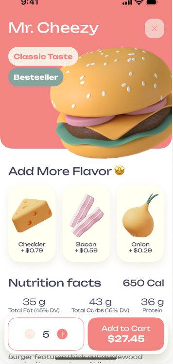

# 🍔 Food Delivery App

A clean, modern, and visually engaging **Food Delivery UI App** built with **Jetpack Compose**, **Kotlin**, and **Material 3**.  
This is a **static UI prototype** — built just for fun and design exploration because I really liked the visual style!

<p align="center">
  
</p>

<p align="center">
  
</p>

---

## ✨ Features

- 🍔 3D-style food previews (burgers, donuts, etc.)
- 🧀 Flavor selection with pricing (e.g., Cheddar, Bacon, Onion)
- 📊 Nutrition facts section with calories & macros
- 🛒 Floating order bar with + / − selectors
- 🎨 Custom Material 3 theme with reusable typography and colors
- 💡 Clean and scrollable UI layout using Jetpack Compose
- 📱 Edge-to-edge screen with hidden system nav bar

---

## 🧠 Why This App?

> I built this app **as a static prototype** just for fun and to explore Jetpack Compose because I loved the UI design.  
It has **no backend** or real data – it’s a design-focused app.

---

## 🛠️ Built With

- [Kotlin](https://kotlinlang.org/) – Modern programming language for Android
- [Jetpack Compose](https://developer.android.com/jetpack/compose) – Declarative UI toolkit
- [Material 3](https://m3.material.io/) – Updated Material Design system
- [Android Studio](https://developer.android.com/studio) – IDE for Android development

---

## ✅ How to Run

1. Clone the repository:
   ```bash
   git clone https://github.com/MEDDADMakhlouf/jetpack-compose-food-delivery-app

## 👤 Author

Made by **MEDDAD Makhlouf**  
🔗 [LinkedIn](https://www.linkedin.com/in/makhlouf-meddad-6674332a5/)  
📧 Email: makhloufmeddad@gmail.com
